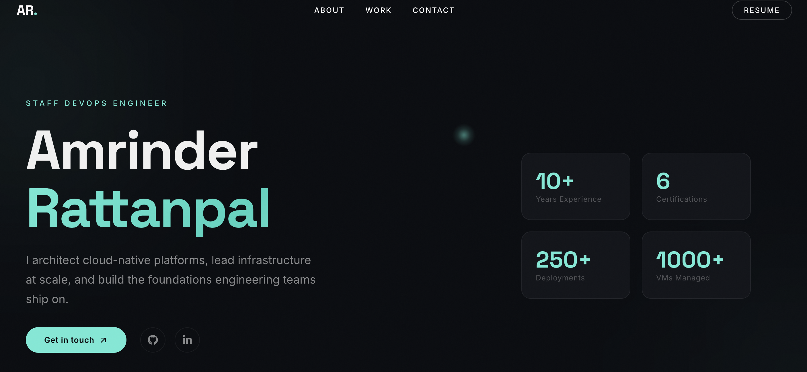

# Amrinder Rattanpal Portfolio

Personal portfolio site for Amrinder Rattanpal, focused on platform engineering, Azure, Kubernetes, DevOps leadership, and cloud-native delivery. The app is built as a fast single-page React site with animated sections, scroll-triggered reveals, a custom cursor, and a horizontally moving tech stack showcase.

[Live site](https://portfolio-basic.ammu-rattan.workers.dev/)



## Overview

This project presents a professional profile through a one-page experience with dedicated sections for:

- Hero introduction and contact CTA
- About summary and certification highlights
- Core areas of expertise
- Career timeline
- Selected project and platform work
- Animated tech stack marquee
- Footer with education, certifications, and social links

The codebase also contains an experimental 3D character module under `src/components/Character`, but it is not currently mounted in the main application flow.

## Stack

- React 18
- TypeScript
- Vite
- GSAP and ScrollTrigger for motion and scroll-based reveals
- React Icons for UI iconography
- Three.js and React Three Fiber tooling for the optional 3D module

## Features

- Responsive single-page portfolio layout
- Content sections tailored to DevOps and cloud-platform work
- Scroll-triggered card and timeline animations
- Custom cursor interactions
- Lazy-loaded sections for lighter initial rendering
- Fast local development and production bundling with Vite

## Project Structure

```text
.
├── public/
│   ├── images/                # Preview and static image assets
│   ├── models/                # Encrypted/related 3D assets
│   └── draco/                 # Draco decoder files
├── src/
│   ├── components/
│   │   ├── Character/         # Optional 3D scene code and utilities
│   │   ├── styles/            # Component-level CSS files
│   │   ├── About.tsx
│   │   ├── Career.tsx
│   │   ├── Contact.tsx
│   │   ├── Cursor.tsx
│   │   ├── Landing.tsx
│   │   ├── MainContainer.tsx  # Main page composition
│   │   ├── Navbar.tsx
│   │   ├── TechStack.tsx
│   │   ├── WhatIDo.tsx
│   │   └── Work.tsx
│   ├── context/               # Loading state provider
│   ├── data/                  # Static data/config where needed
│   ├── App.tsx
│   ├── index.css
│   └── main.tsx
├── index.html
├── package.json
└── vite.config.ts
```

## Getting Started

### Prerequisites

- Node.js 18 or newer
- npm 9 or newer

### Install

```bash
npm install
```

### Run Locally

```bash
npm run dev
```

The Vite dev server is started with `--host`, which makes the site accessible from your local network as well as `localhost`.

## Scripts

```bash
npm run dev
```

Starts the local development server.

```bash
npm run build
```

Runs TypeScript project builds and creates the production bundle in `dist/`.

```bash
npm run preview
```

Serves the production build locally for verification.

```bash
npm run lint
```

Runs ESLint across the project.

## Customization

If you want to reuse this portfolio structure for another profile, the main edit points are:

- `src/components/Landing.tsx` for the hero section, intro copy, and social links
- `src/components/About.tsx` for the personal summary and highlights
- `src/components/WhatIDo.tsx` for service areas and tags
- `src/components/Career.tsx` for the career timeline
- `src/components/Work.tsx` for featured projects and platform work
- `src/components/Contact.tsx` for footer details, education, certifications, and contact links
- `src/components/styles/` for section styling

## Notes

- The current portfolio content is hardcoded directly in the React components rather than loaded from a CMS or API.
- The repository still includes a 3D scene subsystem and related assets, but the current application experience is primarily a polished 2D portfolio with animation-driven presentation.
- There is no backend service in this project; deployment is static-host friendly.

## Deployment

Build the site:

```bash
npm run build
```

Preview it locally:

```bash
npm run preview
```

Then deploy the generated `dist/` directory to a static hosting platform such as Cloudflare Pages, Vercel, or Netlify.

## License

This project is licensed under the [MIT License](LICENSE).
